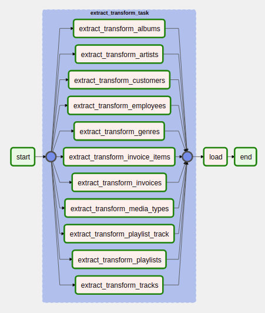

# ETL Airflow

ETL Learning Project Using Airflow

## Prerequisite

- Docker
- Docker Compose

## How to run

- On Linux, the mounted volumes in container use the native Linux filesystem user/group permissions, so you have to make sure the container and host computer have matching file permissions.

    ```
    mkdir ./dags ./data ./logs ./output/sqlite ./plugins
    ```

    ```
    echo -e "AIRFLOW_UID=$(id -u)\nAIRFLOW_GID=0" > .env
    ```

- Run database migrations and create the first user account.

    ```
    docker-compose up airflow-init
    ```

    The account created has the login `airflow` and the password `airflow`.

- Before running docker compose, you need to build image because there's some python packages we need.

    ```
    docker build .
    ```

- Now run all services

    ```
    docker-compose up
    ```

- After it's all set, access the webserver

    ```
    http://localhost:8080/
    ```

## What does my code do?

- It's a DAG (Directed Acyclic Graph), DAG is a collection of all the tasks you want to run, organized in a way that reflects their relationships and dependencies.

- Every DAG represents ETL (Extract, Transform, Load) process.
  - Extract is the process of reading data from a datasource. In this stage, the data is collected, often from multiple and different types of sources.
  - Transform is the process of converting the extracted data from its previous form into the form it needs to be in so that it can be placed into another database. Transformation occurs by using rules or lookup tables, by combining the data with other data or by cleaning the tables.
  - Load is the process of writing the data into the target database.

- It's an example of my DAG that using dynamic TaskGroup in extract process:


